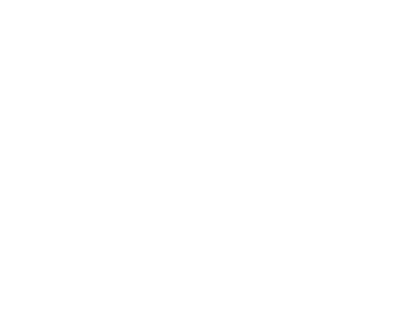
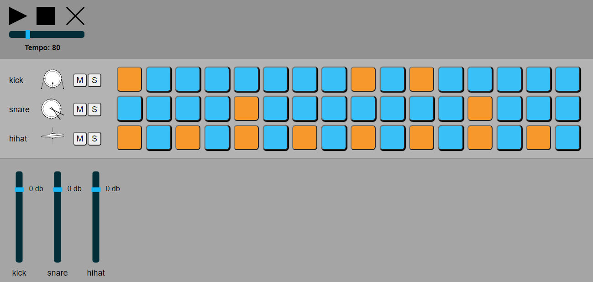

# Drum sequencer for cool boys and girls



## What is it?

This is a simple drum sequencer application, builded on [`create-react-app`](https://github.com/facebook/create-react-app) and using [`ToneJS`](https://tonejs.github.io/) to play music

## What can i do with it?

With this app you can:

- create your own beats with kick, snare and hihat drums
- turn playback on/off and change tempo with transport section
- take controll of each channel with mixer, wich includes volume faders
- use mute/solo buttons to isolate channels from playback
- be the coolest boy/girl in the whole world

## How to launch it?

First, you need preinstalled [NodeJS](https://nodejs.org/en/) and [Git](https://git-scm.com/) on your computer. Then you need to execute commands down below:

```sh
git clone https://github.com/fetidbell/drums-pumps.git
cd ./drums-pumps
npm install
npm start
```

Navigate to http://localhost:3000/ in the browser - app will be ready to use!
